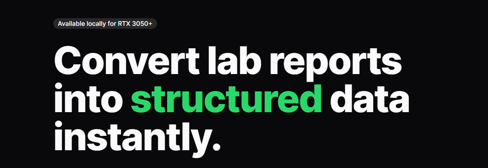

<div align="center">
  
</div>

---

## 👨‍💻 Author

<div align="center">
  <h3>Created by Shubham Kambli</h3>
  <p><i>Founder of COSMIC • AI Engineer • Open-Source Builder</i></p>
  
  <p>19-year-old Founder of COSMIC, AI engineer, and open-source builder creating production-ready tools at the intersection of artificial intelligence and software engineering.</p>
  
  <p>
    🌐 <a href="https://shubhamkambli.com">shubhamkambli.com</a> • 
    📧 <a href="mailto:shubhamkambli1112@gmail.com">shubhamkambli1112@gmail.com</a> • 
    💼 <a href="#">LinkedIn</a> • 
    🐦 <a href="https://twitter.com/Not_Shubham_111">@Not_Shubham_111</a>
  </p>
  
  <p>
    📖 <a href="#">View Full Portfolio</a> • 
    🏠 <a href="#">Wiki Home</a>
  </p>
</div>

---

<div align="center">
  <h1>Med-Intel</h1>
  <p><b>Advanced Clinical Data Analysis & AI Dashboard</b></p>
  <p>
    <a href="#features">Features</a> •
    <a href="#tech-stack">Tech Stack</a> •
    <a href="#getting-started">Getting Started</a>
  </p>
</div>

---

## 🚀 Overview

**Med-Intel** (formerly Helix) is a high-performance, production-ready SaaS platform tailored for healthcare professionals. It provides a dual-panel clinical dashboard designed to streamline medical data analysis. With intelligent multimodal model routing, real-time AI report generation, and a strictly minimalist aesthetic, Med-Intel ensures that clinical data is processed quickly, accurately, and professionally.

---

## ✨ Features

- 🏥 **Dual-Panel Medical Interface:** Seamless side-by-side view featuring real-time streaming for both report generation and AI chat, completely eliminating UI latency.
- 🧠 **Intelligent Multimodal Model Routing:** Automatically switches between highly optimized text-only models and advanced vision-capable models based on the uploaded input type.
- 💬 **Clinical Chat Interface:** Provides concise, report-based risk assessments. The AI adheres to strict formatting rules (markdown-free, verified terminology) to maintain a professional, non-diagnostic tone.
- 🛡️ **Robust Fallback Chains:** Uses an advanced model chain (Gemma 4, Nemotron, Gemma 2, and Gemini) to eliminate data extraction errors and intelligently route around rate-limiting (429) issues.
- 🎨 **Minimalist & Professional Aesthetic:** Built around a sleek, high-contrast design system (`#5AFF88`, `#FFFFFF`, `#1D1D1D`) prioritizing readability and reducing visual clutter.

---

## 💻 Tech Stack

### Frontend
- **Framework:** Next.js 16 (App Router)
- **Library:** React 19
- **Styling:** Tailwind CSS v4, `shadcn/ui`
- **Typography/Icons:** Lucide React, Custom Google Fonts

### Backend
- **Framework:** FastAPI (Python)
- **AI/ML:** Custom model routing pipeline
- **Architecture:** Local robust deployment with graceful shutdown mechanisms

---

## 🛠️ Getting Started

### Prerequisites
- Node.js (v18+)
- Python (3.10+)
- npm or yarn

### Installation

1. **Clone the repository**
   ```bash
   git clone https://github.com/NotShubham1112/Helix.git
   cd Helix
   ```

2. **Setup the Backend**
   ```bash
   cd helix-backend
   python -m venv .venv
   source .venv/bin/activate  # On Windows use: .venv\Scripts\activate
   pip install -r requirements.txt
   python run.py
   ```

3. **Setup the Frontend**
   ```bash
   cd ../helix
   npm install
   npm run dev
   ```

4. **Access the Dashboard**
   Open [http://localhost:3000](http://localhost:3000) in your browser to view the application.
