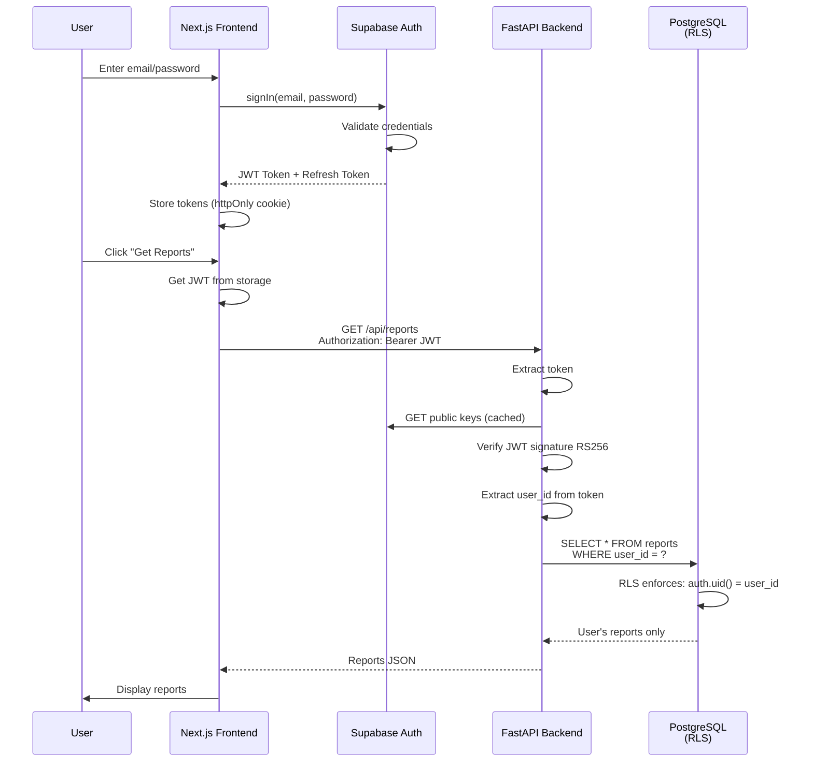
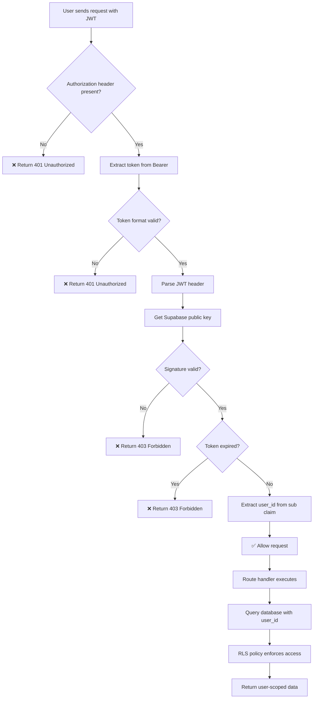
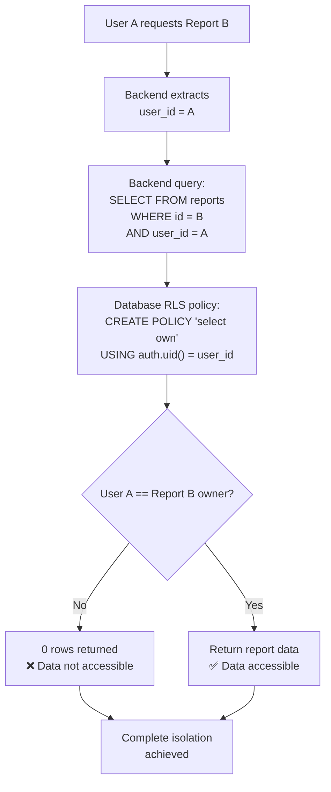
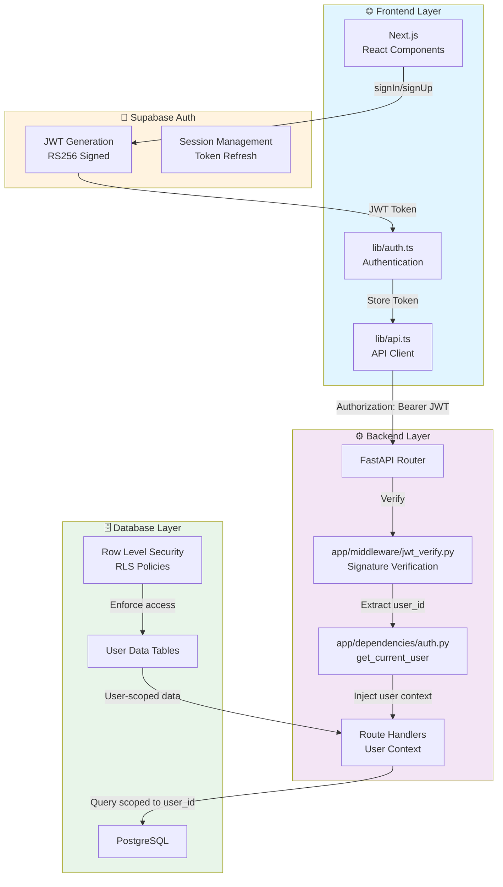

# HELIX Authentication System - Visual Architecture

This document contains ASCII and Mermaid diagrams showing the authentication flow.

## 1. Complete Authentication Flow

```
┌──────────────────────────────────────────────────────────────────────────────┐
│                     HELIX AUTHENTICATION SYSTEM                              │
└──────────────────────────────────────────────────────────────────────────────┘

STEP 1: USER AUTHENTICATION
┌──────────────┐
│  Next.js     │
│  Frontend    │
│              │
│  Login Form  │───(email/password)───▶ ┌─────────────────────────────────┐
│              │                        │   Supabase Auth                 │
│              │◀─(JWT + Refresh)────── │   (Identity Provider)           │
└──────────────┘                        │                                 │
                                        │ ✓ Email/Password               │
                                        │ ✓ OAuth/Social                 │
                                        │ ✓ MFA Support                  │
                                        │                                 │
                                        │ RS256 Signed JWT                │
                                        └─────────────────────────────────┘

STEP 2: FRONTEND TOKEN STORAGE
┌──────────────┐
│  Next.js     │
│  Frontend    │
│              │
│ Store JWT:   │
│ • httpOnly   │
│   Cookie     │  (XSS protected)
│ • Memory     │  (Fast access)
│              │
│ Store        │
│ Refresh      │
│ Token:       │
│ • httpOnly   │
│   Cookie     │  (Secure rotation)
│              │
└──────────────┘

STEP 3: API REQUEST WITH JWT
┌──────────────┐
│  Next.js     │
│  Frontend    │
│              │
│ apiGet()     │
│ apiPost()    │──────────────────────────────┐
│ etc.         │   Authorization:             │
│              │   Bearer eyJhbGci...         │
└──────────────┘                              │
                                              ▼
                                    ┌──────────────────────────┐
                                    │  HTTP Request            │
                                    │  (HTTPS in production)   │
                                    └──────────────────────────┘
                                              │
                                              ▼

STEP 4: BACKEND JWT VERIFICATION
┌──────────────────────────────────────────────────────────────┐
│  FastAPI Backend                                             │
│                                                              │
│  @router.get("/api/profile")                                │
│  def get_profile(                                           │
│    user=Depends(get_current_user)  ◀─ Extraction starts    │
│  ):                                                          │
│      return user                                             │
│                                                              │
│  ┌────────────────────────────────────────────────────────┐ │
│  │ get_current_user dependency:                           │ │
│  │                                                        │ │
│  │ 1. Extract Authorization header                       │ │
│  │    Authorization: Bearer <token>                      │ │
│  │                                                        │ │
│  │ 2. Get token from header                              │ │
│  │    token = "eyJhbGciOiJSUzI1NiIs..."                  │ │
│  │                                                        │ │
│  │ 3. Get Supabase public key (cached)                   │ │
│  │    https://PROJECT.supabase.co/auth/v1/keys          │ │
│  │                                                        │ │
│  │ 4. Verify JWT signature with RS256                    │ │
│  │    jwt.decode(token, public_key, RS256)              │ │
│  │    ✓ If valid: Continue                              │ │
│  │    ✗ If invalid: Return 403 Forbidden                │ │
│  │                                                        │ │
│  │ 5. Verify token not expired                           │ │
│  │    payload["exp"] > now()                             │ │
│  │    ✓ If valid: Continue                              │ │
│  │    ✗ If expired: Return 403 Forbidden                │ │
│  │                                                        │ │
│  │ 6. Extract claims from payload:                       │ │
│  │    user_id = payload["sub"]     ← CRITICAL            │ │
│  │    email = payload["email"]                           │ │
│  │    role = payload["user_metadata"]["role"]            │ │
│  │                                                        │ │
│  │ 7. Return verified payload to route handler           │ │
│  │    payload = {                                        │ │
│  │      "sub": "user-123",                               │ │
│  │      "email": "doctor@hospital.com",                  │ │
│  │      "role": "doctor",                                │ │
│  │      ...                                              │ │
│  │    }                                                   │ │
│  └────────────────────────────────────────────────────────┘ │
│                                                              │
└──────────────────────────────────────────────────────────────┘

STEP 5: DATABASE ACCESS CONTROL
┌──────────────────────────────────────────────────────────────┐
│  Route Handler (with user_id guarantee)                     │
│                                                              │
│  user_id = payload["sub"]  ◀─ From verified JWT            │
│                                                              │
│  ┌────────────────────────────────────────────────────────┐ │
│  │ Backend Query:                                         │ │
│  │                                                        │ │
│  │ reports = db.query(Report).filter(               ─┐   │ │
│  │   Report.user_id == user_id  ◀─ CRITICAL       ─┘   │ │
│  │ ).all()                                              │ │
│  │                                                        │ │
│  │ Database RLS Enforcement:                            │ │
│  │                                                        │ │
│  │ CREATE POLICY "Users select own"                     │ │
│  │   ON reports FOR SELECT                              │ │
│  │   USING (auth.uid() = user_id)                       │ │
│  │          ▲                                            │ │
│  │          └── Double-checks user_id match             │ │
│  │                                                        │ │
│  │ ✓ Defense in depth:                                  │ │
│  │   • Backend filters by user_id                       │ │
│  │   • Database RLS policy enforces it                  │ │
│  │   • User can ONLY access own data                    │ │
│  └────────────────────────────────────────────────────────┘ │
│                                                              │
└──────────────────────────────────────────────────────────────┘

STEP 6: RESPONSE TO FRONTEND
┌──────────────────────────────────────────────────────────────┐
│  Backend Returns:                                            │
│  {                                                           │
│    "user_id": "user-123",     ◀─ From verified JWT          │
│    "email": "doctor@hospital.com",                          │
│    "reports": [               ◀─ Only user's reports        │
│      {                                                       │
│        "id": "report-456",                                  │
│        "user_id": "user-123", ◀─ Scope enforced             │
│        "title": "Lab Results",                              │
│        "created_at": "2024-01-15"                           │
│      }                                                       │
│    ]                                                         │
│  }                                                           │
│                                                              │
│  ✓ Frontend receives only user's own data                   │
│  ✓ Data integrity guaranteed by backend                     │
└──────────────────────────────────────────────────────────────┘
```

## 2. Token Structure

```
JWT Token = Header.Payload.Signature

HEADER:
{
  "alg": "RS256",    ← Algorithm: RS256 (asymmetric)
  "kid": "key-1",    ← Key ID for lookup
  "typ": "JWT"       ← Type: JWT
}

PAYLOAD (Verified):
{
  "iss": "https://PROJECT.supabase.co/auth/v1",  ← Issuer
  "sub": "user-123-abc",                         ← User ID (CRITICAL)
  "aud": "authenticated",                         ← Audience
  "exp": 1692892800,                             ← Expiration (8 hours)
  "iat": 1692889200,                             ← Issued at
  "email": "doctor@hospital.com",                ← Email
  "email_verified": true,                        ← Email verified
  "user_metadata": {                             ← Custom metadata
    "role": "doctor",
    "department": "cardiology",
    "license_number": "MD-12345"
  },
  "session_id": "session-xyz"                    ← Session identifier
}

SIGNATURE (RS256):
RSASHA256(base64UrlEncode(header) + "." + base64UrlEncode(payload), publicKey)

✓ Signature proves token wasn't tampered with
✓ Only Supabase private key can create valid signature
✓ Backend verifies with Supabase public key
```

## 3. RLS Policy Enforcement

```
User A tries to access User B's data:

1. Frontend sends request with JWT:
   Authorization: Bearer <token-A>

2. Backend extracts user_id:
   user_id = "user-A"

3. Backend query:
   SELECT * FROM reports
   WHERE id = 'report-B'
   AND user_id = 'user-A'  ← Backend filter

4. Database RLS policy:
   CREATE POLICY "Users select own"
   ON reports FOR SELECT
   USING (auth.uid() = user_id)
          ▲                ▲
          └─ Supabase ┘ auth.uid() = 'user-A'
            internal   vs user_id in table = 'user-B'
            function
          
5. Result:
   ✗ 0 rows returned (user_id mismatch)
   ✗ User B's data cannot be accessed
   ✓ No SQL error (clean handling)

DEFENSE IN DEPTH:
┌─────────────────────────────────────┐
│ Backend layer:                      │
│ ✓ Verify JWT signature              │
│ ✓ Extract verified user_id          │
│ ✓ Filter all queries by user_id     │
└─────────────────────────────────────┘
           ▼
┌─────────────────────────────────────┐
│ Database layer (RLS):               │
│ ✓ Policy: auth.uid() = user_id      │
│ ✓ Enforced at PostgreSQL level      │
│ ✓ No data returned if mismatch      │
└─────────────────────────────────────┘
           ▼
┌─────────────────────────────────────┐
│ Result:                             │
│ ✓ Impossible to access other users' │
│   data even if backend has bug      │
│ ✓ Complete data isolation           │
└─────────────────────────────────────┘
```

## 4. Token Refresh Flow

```
INITIAL STATE:
┌──────────────┐
│ Access token │  Expires in 8 hours
│ (valid)      │
└──────────────┘
       │
       │ (time passes)
       ▼
┌──────────────────┐
│ Access token     │  Expires in 5 minutes
│ (expiring soon)  │
└──────────────────┘

DETECTION:
Frontend receives 403 Forbidden
Status: "Token expired"

AUTOMATIC REFRESH:
┌────────────────────────────────────────────┐
│ Frontend detects 403:                      │
│                                            │
│ try:                                       │
│   response = await apiGet("/api/reports") │
│ catch 403:                                 │
│   new_session = await auth.refreshToken() │
│   response = await apiGet("/api/reports") │
│   return response                          │
│                                            │
└────────────────────────────────────────────┘
                   │
                   ▼ (Refresh token in httpOnly cookie)
        ┌──────────────────────────────┐
        │  Supabase Auth Service       │
        │                              │
        │  Verify refresh token valid  │
        │  Generate new access token   │
        │  Return new JWT              │
        │                              │
        └──────────────────────────────┘
                   │
                   ▼ (New token stored)
        ┌──────────────────────────────┐
        │  Frontend updates token:     │
        │  • Memory cache              │
        │  • httpOnly cookie           │
        └──────────────────────────────┘
                   │
                   ▼
        ✓ Retry succeeds with new token
        ✓ User experience: seamless

NEW TOKENS:
┌──────────────┐
│ Access token │  Valid for 8 hours
│ (new)        │
└──────────────┘
```

## 5. Security Verification Checklist

```
FOR EVERY REQUEST:

1. Authorization Header Present?
   ✓ "Authorization: Bearer <token>"
   ✗ Missing → return 401 Unauthorized

2. Token Format Valid?
   ✓ "Bearer " prefix + token
   ✗ Malformed → return 401

3. JWT Structure Valid?
   ✓ "header.payload.signature"
   ✗ Invalid → return 403 Forbidden

4. Signature Verifiable?
   ✓ Signature matches payload
   ✗ Tampered → return 403 Forbidden

5. Issuer Correct?
   ✓ iss = "https://PROJECT.supabase.co/auth/v1"
   ✗ Wrong issuer → return 403 Forbidden

6. Audience Correct?
   ✓ aud = "authenticated"
   ✗ Wrong audience → return 403 Forbidden

7. Token Not Expired?
   ✓ exp > now()
   ✗ Expired → return 403 Forbidden

8. All Claims Present?
   ✓ sub, email required
   ✗ Missing claims → return 403 Forbidden

✓ All checks pass → ALLOWED
✓ user_id extracted from sub claim
✓ Request proceeds with verified user context

✗ Any check fails → DENIED
✗ Return appropriate error
✗ Log failed attempt for security
```

---

## Mermaid Diagrams

### Authentication Sequence Diagram



### Token Verification Flow



### Data Access Control



### Architecture Layers



---

**Diagram Status**: ✅ Complete  
**Last Updated**: April 18, 2026
