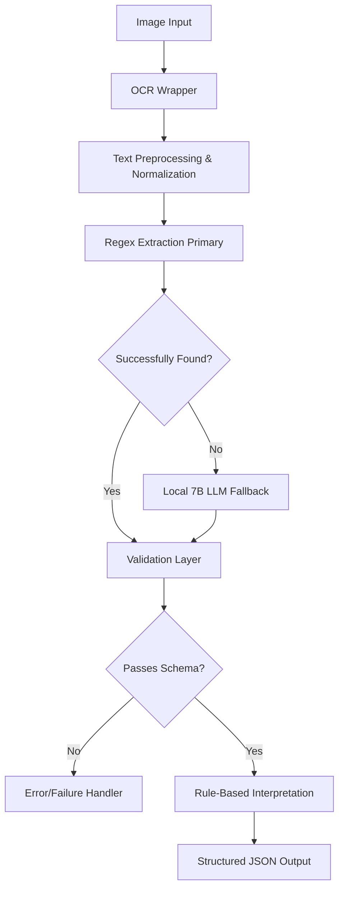

# Goal Description

This implementation plan outlines a strict, local MVP healthcare data extraction system called `Helix`. The MVP is tightly scoped to extracting and interpreting HbA1c values from medical lab reports (images or OCR text). It adheres to local limits (RTX 3050 6GB VRAM constraint constraints), relying primarily on regex, relying only on a quantized 7B parameter local LLM as a fallback extraction mechanism, and exclusively uses a rule-based engine for interpretation to ensure zero hallucination.

## User Review Required

> [!WARNING]  
> The system requires local setup of Tesseract or PaddleOCR (CPU/GPU) as well as Ollama (for the 7B quantized LLM like Mistral-7B-Instruct-v0.2-GGUF). 
> Please review the deterministic logic for HbA1c and Validation Schema before we proceed to code execution.

---

## STEP 1: DEFINE SYSTEM ARCHITECTURE

The architecture follows a strict pipeline: **Input → OCR → Preprocessing → Extraction → Validation → Interpretation → Output**.

**Tool Stack:**
*   **OCR:** `EasyOCR` or `PaddleOCR` (Modular wrapper). EasyOCR is lighter for CPU context, PaddleOCR is preferred for GPU (RTX 3050).
*   **LLM Engine:** Ollama with quantized `mistral:7b-instruct-q4_K_M` (requires < 5GB VRAM).
*   **Backend:** FastAPI (lightweight, native async support).
*   **Language:** Python 3.10+
*   **Validation:** Pydantic V2 (schema enforcement).



---

## STEP 1.5: MODULAR OCR LAYER [NEW]

We will implement an `OcrEngine` service that allows swapping between OCR backends. For the MVP, it will default to a fallback if dependencies are missing, ensuring the system remains "modular and production-upgradable".

```python
class OcrEngine:
    def __init__(self, engine="easyocr"):
        self.engine = engine
        
    def perform_ocr(self, image_content: bytes) -> str:
        # Implementation details for PaddleOCR/EasyOCR
        pass
```

## STEP 2: DESIGN JSON SCHEMA

Strict structure using `Pydantic`. LLM or regex outputs MUST map to this. Any missing parameter degrades gracefully to `null`, triggering a specific interpretation state.

```python
from pydantic import BaseModel, Field
from typing import Optional, Literal

class Parameter(BaseModel):
    name: Literal["HbA1c", "Glucose"]
    value: float
    unit: str
    confidence: float = Field(ge=0.0, le=1.0)
    source_text: str  # The exact text block the value was extracted from

class Interpretation(BaseModel):
    category: Literal["Normal", "Prediabetes", "Diabetes", "Unknown"]
    message: str
    requires_medical_attention: bool

class HelixResponse(BaseModel):
    status: Literal["success", "partial_success", "failed"]
    parameter: Optional[Parameter] = None
    interpretation: Optional[Interpretation] = None
    error: Optional[str] = None
```

---

## STEP 3: EXTRACTION LOGIC

Hybrid extraction approach preferring deterministic regex over LLM generation to guarantee non-halucinated parameters and low latency.

```python
import re
import ollama

def extract_regex(text: str) -> dict | None:
    # Look for HbA1c, A1c, Glycosylated Hemoglobin
    # Example match: "HbA1c : 5.8 %" or "HBA1C 6.4 %"
    pattern = r"(?i)(?:hba1c|a1c|glycosylated\s+hemoglobin)[\s\:\-\=]*(\d{1,2}\.\d{1,2})[\s]*(\%)"
    match = re.search(pattern, text)
    if match:
        val, unit = match.groups()
        # Find local context for source trace
        start = max(0, match.start() - 20)
        end = min(len(text), match.end() + 20)
        source_text = text[start:end].replace('\n', ' ').strip()
        return {
            "name": "HbA1c",
            "value": float(val),
            "unit": "%",
            "confidence": 0.95, 
            "source_text": source_text
        }
    return None

def extract_llm_fallback(text: str) -> dict | None:
    prompt = f"""
    Extract ONLY the HbA1c value and its unit from the text below. 
    Strict rules:
    1. If HbA1c is not found, reply exactly with "NULL".
    2. Do NOT invent missing values.
    3. Format output as: VALUE|UNIT|EXACT_SOURCE_QUOTE

    Text:
    "{text}"
    """
    try:
        response = ollama.chat(model='mistral:7b', messages=[{'role': 'user', 'content': prompt}])
        content = response['message']['content'].strip()
        if "NULL" in content.upper() or "|" not in content:
            return None
        
        parts = content.split('|')
        if len(parts) >= 3:
            return {
                "name": "HbA1c",
                "value": float(parts[0]),
                "unit": parts[1].strip(),
                "confidence": 0.60, # Lower confidence due to LLM fallback
                "source_text": parts[2].strip()
            }
    except Exception:
        pass
    
    return None

def extract_hba1c(text: str) -> dict | None:
    res = extract_regex(text)
    if res:
         return res
    return extract_llm_fallback(text)
```

---

## STEP 4: VALIDATION LAYER

Schema enforcement. Ensure no field is invented by the LLM and the exact source text exists in the OCR result.

```python
def validate_extraction(raw_data: dict, ocr_full_text: str) -> Parameter | None:
    if not raw_data:
        return None
        
    try:
        # Validate Pydantic schema
        param = Parameter(**raw_data)
        
        # Anti-Hallucination check: ensure source_text exists in original OCR text
        # Only verify alphanumeric similarity to handle whitespace issues
        clean_source = "".join(filter(str.isalnum, param.source_text.lower()))
        clean_ocr = "".join(filter(str.isalnum, ocr_full_text.lower()))
        
        if clean_source not in clean_ocr:
            raise ValueError("Hallucination detected: Source text not found in original document.")
            
        return param
    except Exception as e:
        print(f"Validation failed: {e}")
        return None
```

---

## STEP 5: RULE-BASED INTERPRETATION ENGINE

Deterministic interpretation without LLM context. HbA1c limits are clinically standard.

```python
def interpret_hba1c(value: float) -> Interpretation:
    if value < 4.0 or value > 20.0:
         return Interpretation(
             category="Unknown",
             message="Value is outside physiologically expected ranges. Please review the report manually.",
             requires_medical_attention=True
         )
         
    if value < 5.7:
        return Interpretation(
            category="Normal",
            message="HbA1c is within the normal range.",
            requires_medical_attention=False
        )
    elif 5.7 <= value <= 6.4:
        return Interpretation(
            category="Prediabetes",
            message="HbA1c indicates prediabetes. Lifestyle modifications may be recommended.",
            requires_medical_attention=True
        )
    else:
        return Interpretation(
            category="Diabetes",
            message="HbA1c is in the diabetic range. Please consult a healthcare provider.",
            requires_medical_attention=True
        )
```

---

## STEP 6: MINIMAL BACKEND

FastAPI application tying the components together.

```python
from fastapi import FastAPI, HTTPException
from pydantic import BaseModel

app = FastAPI(title="Helix MVP")

class AnalyzeRequest(BaseModel):
    ocr_text: str

@app.get("/health")
def health_check():
    return {"status": "ok", "service": "Helix Local MVP v1"}

@app.post("/analyze-report", response_model=HelixResponse)
def analyze_report(request: AnalyzeRequest):
    ocr_text = request.ocr_text
    if not ocr_text.strip():
        return HelixResponse(status="failed", error="OCR text is empty")
        
    extracted_data = extract_hba1c(ocr_text)
    parameter = validate_extraction(extracted_data, ocr_text)
    
    if not parameter:
        return HelixResponse(status="failed", error="Could not extract valid HbA1c parameter.")
        
    interpretation = interpret_hba1c(parameter.value)
    
    return HelixResponse(
        status="success",
        parameter=parameter,
        interpretation=interpretation
    )
```

---

## STEP 7: FRONTEND (OPTIONAL LIGHT)

A single HTML file to interact with the API, avoiding complexity of a full Next.js site.

```html
<!DOCTYPE html>
<html>
<head>
    <title>Helix Report Analyzer</title>
    <style>
        body { font-family: system-ui, sans-serif; max-width: 600px; margin: 40px auto; padding: 20px; }
        .card { border: 1px solid #ccc; padding: 15px; border-radius: 8px; margin-top: 20px; }
        .confidence { color: green; font-size: 0.9em; }
    </style>
</head>
<body>
    <h2>Upload OCR Text</h2>
    <textarea id="ocrInput" rows="10" style="width:100%;"></textarea><br><br>
    <button onclick="analyze()">Analyze</button>

    <div id="result" class="card" style="display:none;">
        <h3 id="category"></h3>
        <p id="msg"></p>
        <p><strong>Value:</strong> <span id="val"></span></p>
        <p class="confidence">Confidence: <span id="conf"></span> &bull; <i>"<span id="source"></span>"</i></p>
    </div>

    <script>
        async function analyze() {
            const text = document.getElementById('ocrInput').value;
            const res = await fetch('/analyze-report', {
                method: 'POST',
                headers: {'Content-Type': 'application/json'},
                body: JSON.stringify({ocr_text: text})
            });
            const data = await res.json();
            
            if (data.status === 'success') {
                document.getElementById('result').style.display = 'block';
                document.getElementById('category').innerText = data.interpretation.category;
                document.getElementById('category').style.color = data.interpretation.requires_medical_attention ? "red" : "green";
                document.getElementById('msg').innerText = data.interpretation.message;
                document.getElementById('val').innerText = `${data.parameter.value} ${data.parameter.unit}`;
                document.getElementById('conf').innerText = `${(data.parameter.confidence * 100).toFixed(0)}%`;
                document.getElementById('source').innerText = data.parameter.source_text;
            } else {
                alert("Error: " + data.error);
            }
        }
    </script>
</body>
</html>
```

---

## STEP 8: PERFORMANCE OPTIMIZATION

1. **Quantization:** Ollama running `mistral:7b-instruct-q4_K_M` will sit well within the 6GB VRAM constraint of an RTX 3050.
2. **GPU Allocation:** By default, Ollama and PaddleOCR may compete for VRAM. We will document a strategy to restrict OCR to CPU if VRAM pressure is high during LLM fallback.
3. **Deterministic-First:** The `extract_hba1c` function runs standard regex first. This operates in `O(n)` sub-millisecond time. The LLM is NEVER invoked if regex successfully matches, preserving GPU resources and battery on laptops.
4. **LLM Context Limits:** The LLM fallback bounds the prompt. We isolate lines that potentially have percentages instead of feeding a 2-page list of jargon, preserving context window limit.

---

## STEP 9: FAILURE HANDLING

1. **OCR Fails / Garbled:** Checked via Pydantic model enforcing numeric rules on values (`float`) and the fallback regex checks. 
2. **Missing Parameter:** If the regex and the LLM fallback both do not extract data, system returns `status: failed` with `error: "Could not extract valid HbA1c parameter"`. It explicitly does NOT attempt to interpret.
3. **Low Confidence:** Extracted confidence limits are hardcoded based on the pipeline source. If `confidence < 0.8`, the response will include a `warning` flag (extending the schema).
4. **Validation Fail:** Hallucinated values failing the string-inclusion strict validation rule return `None`, defaulting to the pipeline's handled failure state. 
5. **Backend Error:** All endpoints wrapped in try-except returning a clean `HelixResponse` with `status: failed`.

---

## Open Questions

- We currently restrict data bounds to parameter rules handling purely `HbA1c`. Should we wire this explicitly to your pre-existing FastAPI routes (e.g. `/api/analyze/labs` from `app/routes/analyze.py`) or create a standalone implementation module for the MVP isolation?

## Verification Plan

- Will create test suite for `extract_regex` explicitly sending expected and non-expected HbA1c strings.
- Test `Validation Layer` explicitly simulating LLM hallucinating values that are NOT explicitly in the `ocr_full_text`.
- Local verification using Ollama fallback using `mistral:7b` for text input parsing.
